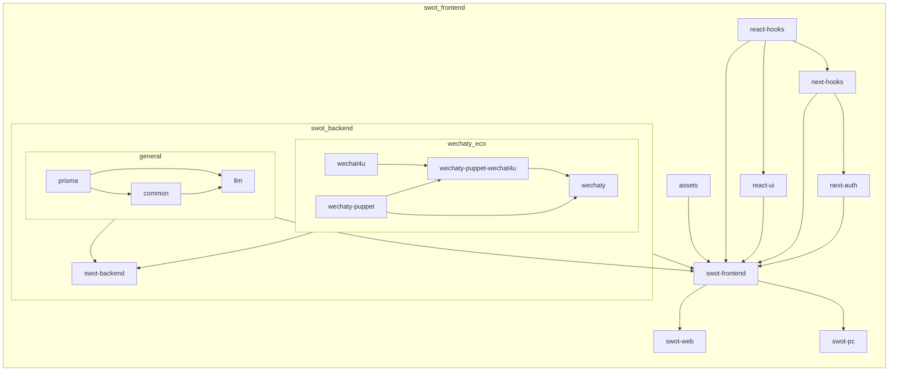

[//]: # (# CS Magic Codebase)


[//]: # (![SWOT Logo]&#40;packages/swot-frontend/src/assets/branding/enterprise/swot.png&#41;)

## Project Overview



## Preparation

- wechaty-puppet 相关需要安装 `jq`，而且不能用 yarn 装，要在系统级别 (2024-06-13)：
    - mac: `brew install jq`
    - ubuntu: `sudo apt install jq`
- installation: `yarn`
- env 配置（参考 env.sample）
- db migrate: `yarn workspace @cs-magic/prisma db:migrate:dev`

## Run

```shell
# start web in dev
yarn workspace @cs-magic/swot-backend dev & yarn workspace @cs-magic/swot-web dev

# start pc in dev
yarn workspace swot-pc dev

# build backend
yarn workspace @cs-magic/swot-backend build

# build web
yarn workspace @cs-magic/swot-frontend build

# build pc
yarn workspace swot-pc build:mac

# start web after build
yarn workspace @cs-magic/swot-frontend start

# start pc after build
# 双击安装 packages/swot-pc/dist/swot-pc-${version}.dmg
```

## References 

- [Tech](__docs__/tech.md)
- [Finished Todo](__docs__/finished-todo.md)

## TODO

- [ ] fix eval-ai running prisma
- [ ] 【重要】server function split for swot-pc
- [ ] `react-hooks` split next/next-auth
- [ ] `next` 需要从 18.3.0 降为 18.2.0 否则 dev 运行 `@cs-magic/homepage` 会有 warning
