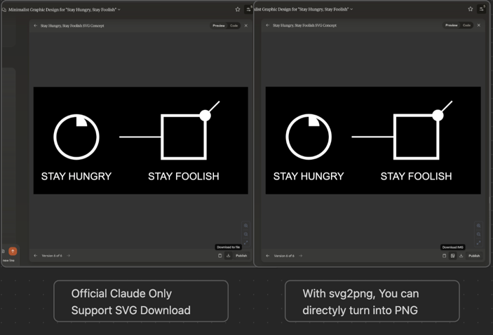

# AIGC Enhancer

> The Enhancer for popular AIGC products.
>
> To be continued ...

## Claude SVG To PNG

### Effect

### Motivation

[Claude Artifact](https://support.anthropic.com/en/articles/9487310-what-are-artifacts-and-how-do-i-use-them) is pretty useful, but with one fatal shortage when it comes downloading the svg into png/jpg for sharing on social media like WeChat.

I used to download the SVG via the built-in action button, and upload onto third-party website like https://cloudconvert.com/svg-to-png which is limited and inconvenient.

So I spent a whole day developing this tiny extension in order to save your day.

Enjoy it!

## Todo

- [ ]: feat: poe supports artifact
- [ ]: fix: `SecurityError: Failed to execute 'toBlob' on 'HTMLCanvasElement': Tainted canvases may not be exported.
at img.onload (`
- [ ]: feat: download with svg together
- [ ]: feat: download with history together
- [ ]: fix the onMouseOut on `svg2png`
- [x]: fix when svg content changed
- [x]: fix when generating new image
