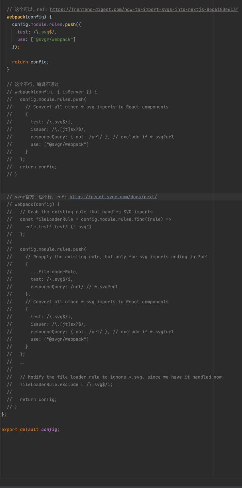
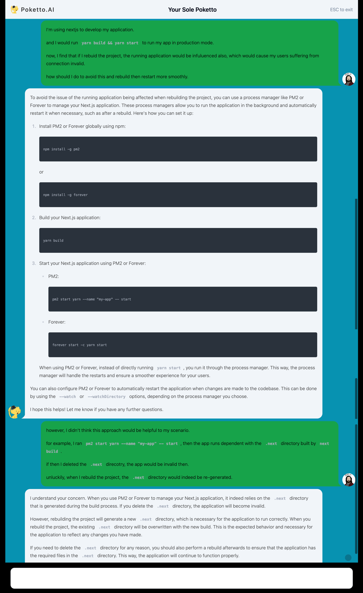
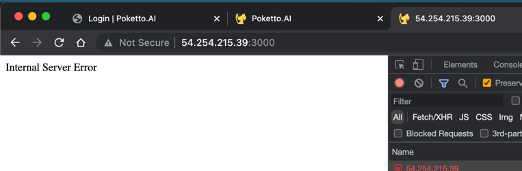
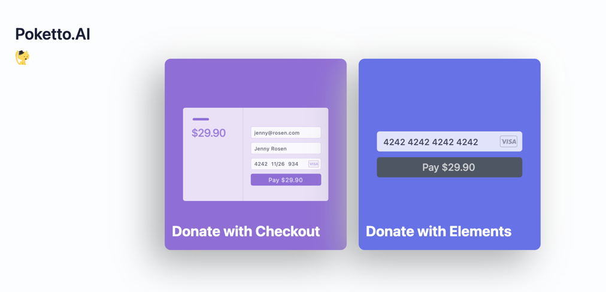
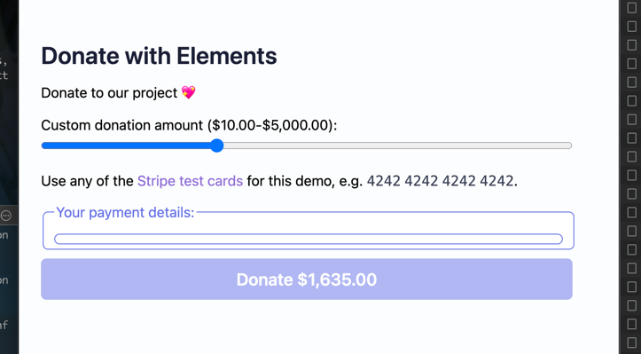
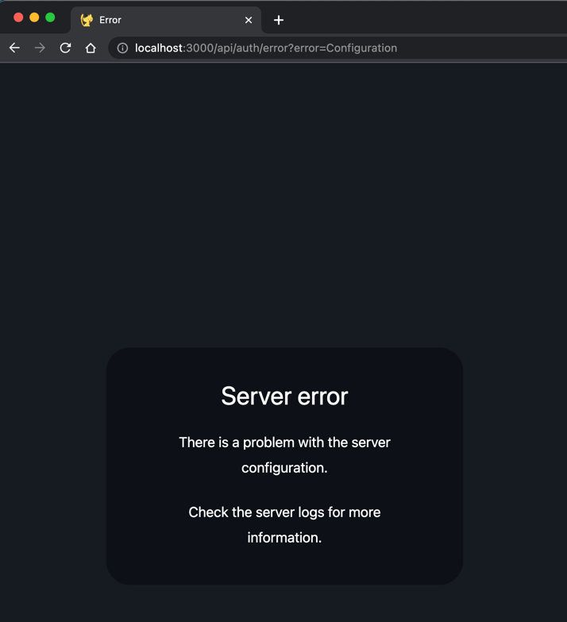

## prisma / validate

ref: https://stackoverflow.com/a/69943634/9422455

## radix-ui

在使用 `dialog` 等交互的时候，子元素不能是 nested 可点击的，应该给一个 pure view component

否则，会报： [Dialog component - validateDOMNesting(...): <button> cannot appear as a descendant of <button> · Issue #1102 · shadcn-ui/ui](https://github.com/shadcn-ui/ui/issues/1102)
之类的错误

## eslint

参考 docusaurus 的： https://github.com/facebook/docusaurus/blob/main/.eslintrc.js

再做了一些修改：

- 剔除了 docusaurus 自己的插件
- 降低了很多规则的level

## nextjs svg

看区别，要放松一下条件，才能通过：



## nextjs font

- 这篇不错： https://blog.logrocket.com/next-js-font-optimization-custom-google-fonts/#using-locally-configured-fonts

## nextjs deploy

- todo: Deployment strategy best practices · Issue #4337 · vercel/next.js, https://github.com/vercel/next.js/issues/4337

- gpt 说可以直接用 pm2 去控制程序，但其实是不行的：



- 我目前先使用复制策略
  （参考: [node.js - Zero downtime deployment with Next.js - Stack Overflow](https://stackoverflow.com/questions/73322929/zero-downtime-deployment-with-next-js)）：

in package.json:

```json
{
  "update": "DIST=.next-tmp && git stash && git pull -f && yarn && DIST=$DIST yarn build && rm -rf .next && mv $DIST .next"
}
```

then run in shell:

```shell
# before start
yarn update

# start
p=poketto && pm2 start --name $p "yarn start -p 30817" && pm2 log $p

# restart
p=poketto && pm2 restart $p && pm2 log $p
```

因为我测试了在运行 nextjs app 的过程中，重新编译 nextjs 其实还是会导致 500 error的：



## chatbot streaming backend essential

> by mark@cs-magic.com

### approach 1. streaming (with callback) via openai + ai-sdk

```typescript
import { Configuration, OpenAIApi } from "openai-edge"

export const runtime = "edge"

const openai = new OpenAIApi(config)

export default async function(req: Request, res: Response) {

  const data = await req.json()
  const { messages, conversationId } = data

  // Ask OpenAI for a streaming chat completion given the prompt
  const response = await openai.createChatCompletion({
    model: "gpt-3.5-turbo",
    // other model configuration
    stream: true,
    messages: messages.map((message: { content: string; role: PromptRoleType }) => ({
      content: message.content,
      role: message.role,
    })),
  })

  // Convert the response into a friendly text-stream
  const stream = OpenAIStream(response, {
    onFinal: (data) => {
      // console.log("onFinal: ", { data })
    },
  })
}
```

### approach 2. streaming (with callback) via langchain(llm) + ai-sdk

```typescript
import { Configuration, OpenAIApi } from "openai-edge"

export const runtime = "edge"

const openai = new OpenAIApi(config)

export default async function(req: Request, res: Response) {

  const model = new ChatOpenAI({
    modelName: "gpt-3.5-turbo",
    // other model configuration

    // stream / callback, ref: https://js.langchain.com/docs/modules/model_io/models/chat/how_to/streaming
    callbacks: [
      {
        handleLLMEnd(output: LLMResult, runId: string, parentRunId?: string, tags?: string[]): Promise<void> | void {
          // console.log("LLMEnd: ", JSON.stringify({ output, runId, parentRunId, tags }, null, 2))
          const content = output.generations
            .flat()
            .map((g) => g.text)
            .join("\n\n---\n\n")
          void pushMessage({ content, role: PromptRoleType.assistant, id: replyId })
        },
      },
    ],
  })

  const prompt =
    PromptTemplate.fromTemplate(`The following is a friendly conversation between a human and an AI. The AI is talkative and provides lots of specific details from its context. If the AI does not know the answer to a question, it truthfully says it does not know.

Relevant pieces of previous conversation:
{history}

(You do not need to use these pieces of information if not relevant)

Current conversation:
Human: {input}
AI:`)

  const outputParser = new BytesOutputParser()
  const chain = prompt.pipe(model).pipe(outputParser)
  const stream = await chain.stream({
    history: context.map((m) => `${m.role}: ${m.content}`).join("\n"),
    input: content,
  })
  return new StreamingTextResponse(stream)
}
```

### (todo) approach 3. streaming via langchain(chat) + ai-sdk

### extension 1. add rate limiter

```typescript
import { env } from "@/env.mjs"
import { Ratelimit } from "@upstash/ratelimit"
import { kv } from "@vercel/kv"

export const validateRequest = async (req: Request) => {
  if (env.KV_REST_API_URL && env.KV_REST_API_TOKEN) {
    const ip = req.headers.get("x-forwarded-for")
    const ratelimit = new Ratelimit({
      redis: kv,
      // rate limit to 1 requests per 20 seconds
      limiter: Ratelimit.slidingWindow(3, "10s"),
    })

    const { success, limit, reset, remaining } = await ratelimit.limit(`ratelimit_${ip}`)

    if (!success) {
      return new Response("Hey man, you are too fast! Please slow down!", {
        status: 429,
        headers: {
          "X-RateLimit-Limit": limit.toString(),
          "X-RateLimit-Remaining": remaining.toString(),
          "X-RateLimit-Reset": reset.toString(),
        },
      })
    }
  }
}
```

### extension 2: add error handler in approach 1

```typescript

// const response = await openai.createChatCompletion({...

if (response.status !== 200) {
  const {
    error: { message },
  } = await response.json()
  return NextResponse.json(message, { status: 500 })
}
```

### extension 3: get metadata from frontend, e.g. userId, conversationId

```typescript
// frontend
const { isLoading, messages, data, handleSubmit, input, handleInputChange, setMessages, stop } = useChat({
  // ...,
  sendExtraMessageFields: true, // 添加 id 信息
  body: { userId, conversationId },
// ...
})

```

```typescript
// backend
const data = await req.json()
const { messages, conversationId, userId } = data
```

### extension 4: add vector database search in approach 2

> based on `trpc data proxy` + `prisma`

```typescript
// backend api router

import superjson from "superjson"
import { createTRPCProxyClient, httpBatchLink } from "@trpc/client"

const proxy = createTRPCProxyClient<RootRouter>({
  links: [
    // loggerLink(),
    httpBatchLink({ url: `${req.headers.get("origin")}/api/trpc` }),
  ],
  transformer: superjson,
})

const context = await proxy.message.getContext.query({ conversationId, content })
```

```typescript
// trpc router

import { createTRPCRouter, protectedProcedure, publicProcedure } from "@/server/trpc.helpers"
import { ChatMessage } from "@prisma/client"
import { CreateMessage } from "ai"
import _ from "lodash"

export const msgRouter = createTRPCRouter({
  getContext: publicProcedure
    .input(z.object({ conversationId: z.string(), content: z.string(), count: z.number().default(5) }))
    .query(async ({ ctx: { prisma }, input: { conversationId, content, count } }) => {
      const vectorStore = PrismaVectorStore.withModel<ChatMessage>(prisma).create(new OpenAIEmbeddings(), {
        prisma: Prisma,
        tableName: "ChatMessage",
        vectorColumnName: "vector",
        columns: {
          id: PrismaVectorStore.IdColumn,
          content: PrismaVectorStore.ContentColumn,
          role: PrismaVectorStore.ContentColumn,
        },
        filter: {
          conversationId: {
            equals: conversationId,
          },
        },
      })
      const similar = (await vectorStore.similaritySearch(content, count)).map((m) => m.metadata)
      const latest = await prisma.chatMessage.findMany({
        where: { conversationId },
        take: DEFAULT_LATEST_COUNT,
        orderBy: { id: "desc" },
      })
      // todo: max token control
      // lodash 不能在 edge 里使用
      return _.sortedUniqBy([...similar, ...latest.reverse()], "id") as CreateMessage[]
    }),
})
```

### extension 5. persisting message to database

> based on `trpc data proxy` + `prisma`

```typescript

/**
 * call it when:
 *  1. persist user request via `res.json().messages[-1]`
 *  2. persist llm response in callback handler (differnet depends on implementation)
 *
 * @param msg: {role: string, content: string, id: string}
 */
const pushMessage = async (msg: Message) => {
  const { id, role, content } = msg
  const newMessage: ChatMessageUncheckedCreateInput = {
    role,
    content,
    conversationId,
    shortId: id,
  }
  console.log("pushing: ", newMessage)
  await proxy.message.push.mutate(newMessage)
}

```

## server

- references:
    - node sdk: https://github.com/stripe/stripe-node#configuration
    - esm: https://stripe.com/docs/libraries/stripejs-esmodule
    - react: https://stripe.com/docs/stripe-js/react
    - api keys: https://dashboard.stripe.com/apikeys
    - products dashboard: https://dashboard.stripe.com/pricing-tables/prctbl_1NcBRrHb6cJdkB4pyeFBevTI
    - embedding pricing table doc: https://stripe.com/docs/payments/checkout/pricing-table

- examples:
    - (recommend) checkout example: https://vercel.com/guides/getting-started-with-nextjs-typescript-stripe
    - (recommend) nextjs official checkout
      example: https://github.com/vercel/next.js/tree/canary/examples/with-stripe-typescript
    - taxonomy server example: https://github.com/cs-magic/taxonomy/blob/main/app/api/users/stripe/route.ts
    - nextjs prisma server: https://github.com/BastidaNicolas/nextauth-prisma-stripe
    -

- pricing table (embedded)
    - 重点参考里面的 react 环节，以及小心 typescript
      部分的声明： https://stripe.com/docs/payments/checkout/pricing-table#embed
    -

- 捐款 demo （nextjs + Element): https://github.com/vercel/next.js/tree/canary/examples/with-stripe-typescript
    - 
    - 但是里面的 `Element` 总是出不来：
        - 

## next-auth

### bug: server-error



这个问题，主要是因为没有配置 `next-auth` 的秘钥，但又用了 middleware。

参考：

- https://next-auth.js.org/configuration/nextjs#prerequisites
- https://stackoverflow.com/a/71093567/9422455

## UI / tailwind

- 子元素
    - https://stackoverflow.com/questions/67119992/how-to-access-all-the-direct-children-of-a-div-in-tailwindcss
- 分组
    - 结论：确实用括号后代码的可扩展性比较差，但是直接写也不太方便，感觉最好直接用 `@apply` 定义自己的原子组件，现阶段先能少用插件就少用插件！
    - 参考
        - 【必看】Grouping variants together · tailwindlabs/tailwindcss · Discussion
          #8337, https://github.com/tailwindlabs/tailwindcss/discussions/8337
        - milamer/tailwind-group-variant: Group multiple tailwind classes into a single
          variant, https://github.com/milamer/tailwind-group-variant
        - 