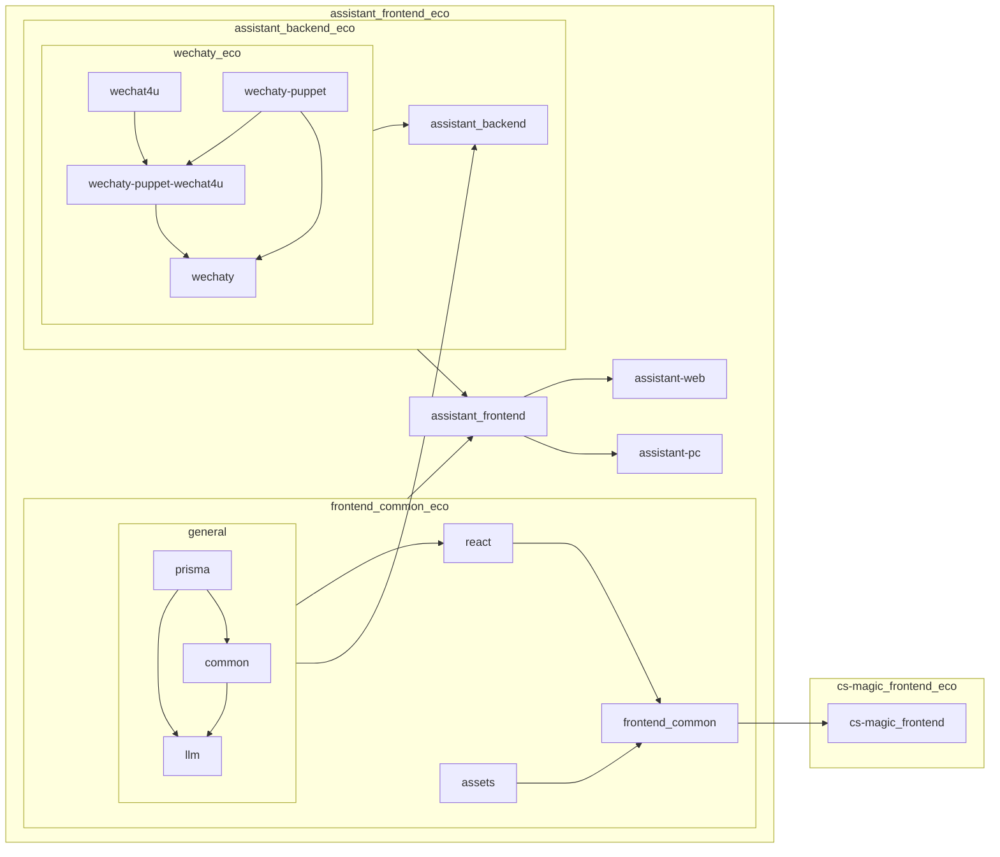

## Tech

### project relative instruction

- `wechaty-puppet-*` 之类的 puppet 的 dependencies 里不要加 `wechaty`，否则在 yarn monorepo 里会导致 circular dependencies error，主要是这些 puppet 的实际代码里也没有 `wechaty` （只在 tests 里有）
- `next-auth` 的 package.json 里 type 不能是 module，否则 nextjs 导入时会有 provider default 问题

## Project Overview

